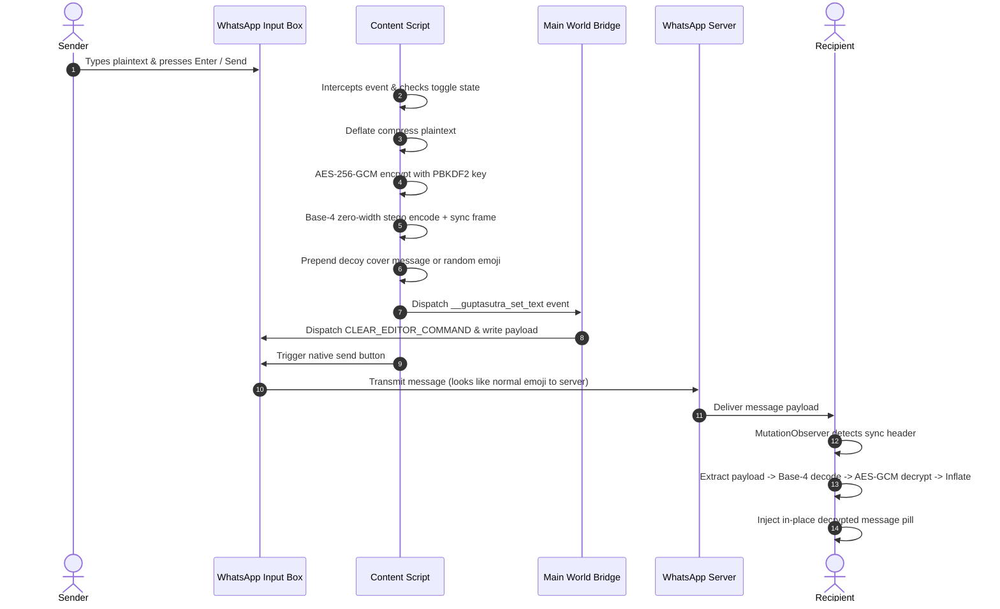

<div align="center">

# Guptasutra

**Stealth End-to-End Encryption & Zero-Width Steganography Engine for Web Chat**

[](https://developer.chrome.com/docs/extensions/mv3/intro/)
[](https://www.w3.org/TR/WebCryptoAPI/)
[-000000?style=for-the-badge)](https://en.wikipedia.org/wiki/PBKDF2)
[](https://developer.mozilla.org/en-US/docs/Web/API/CompressionStream)
[](https://web.whatsapp.com)
[](LICENSE)

</div>

---

## Overview

I built Guptasutra to solve covert communication on modern web chat platforms. Chat platforms inspect message content, trigger keyword filters, and store plaintext logs on remote servers. Overt encryption tools produce obvious PGP blocks or raw hex dumps that draw immediate suspicion.

I designed Guptasutra to embed authenticated, encrypted payloads into everyday conversation text without visual distortion. The extension compresses plaintext, encrypts the output with AES-256-GCM, and converts the binary ciphertext into invisible base-4 Unicode characters (`\u200B`, `\u200C`, `\u200D`, `\uFEFF`). Observers, network monitors, and host application servers inspect a standard decoy sentence or neutral emoji. Recipients with the matching shared key read the decrypted plaintext in-line.

```
+------------------+      +-------------------+      +-------------------------+
| Secret Plaintext | ---> | Deflate + AES-GCM | ---> | Base-4 Zero-Width Stream|
+------------------+      +-------------------+      +-------------------------+
                                                                  |
                                                                  v
+------------------+      +-------------------+      +-------------------------+
| Decrypted Inline | <--- | Decrypt + Inflate | <--- | Decoy Message / Emoji   |
| Message Pill     |      | Pipeline          |      | ("👍" + Invisible Data) |
+------------------+      +-------------------+      +-------------------------+
```

---

## Key Technical Highlights

### 1. Lexical State Machine Hooking (`bridge.js`)
Meta builds WhatsApp Web on top of the Lexical rich-text framework. Lexical ignores untrusted synthetic browser keyboard events (`isTrusted: false`) and rejects standard input value updates. I solved this by splitting execution across two runtime worlds:
- **Main World (`bridge.js`)**: Executes in the page context (`world: "MAIN"`) to access `element.__lexicalEditor`. I dispatch internal `CLEAR_EDITOR_COMMAND` signals and write new text nodes to the Lexical document tree.
- **Isolated World (`content.js`, `adapter.js`)**: Manages browser storage, executes the cryptographic pipeline, and dispatches custom DOM events (`__guptasutra_set_text`) across the boundary.

### 2. Base-4 Steganographic Codec (`stego.js`)
I mapped raw payload bytes into two-bit dibits, encoded across four non-printing Unicode characters:

| Bits | Hex Codepoint | Unicode Name | Byte Representation |
| :---: | :---: | :--- | :--- |
| `00` | `\u200B` | Zero Width Space | `E2 80 8B` |
| `01` | `\u200C` | Zero Width Non-Joiner | `E2 80 8C` |
| `10` | `\u200D` | Zero Width Joiner | `E2 80 8D` |
| `11` | `\uFEFF` | Zero Width No-Break Space (BOM) | `EF BB BF` |

### 3. Framing & Magic Sync Header
WhatsApp appends timestamps, read receipts, and system metadata to chat message containers. To prevent parser failures, I designed a structured binary frame:
- **Sync Header (6 codepoints)**: `\u200C\u200D\u200C\u200D\uFEFF\uFEFF`
- **Length Header (16 codepoints)**: 32-bit big-endian integer tracking total payload characters.
- **Payload Data**: Base-4 encoded ciphertext stream.
- **Boundary Defense**: My decoder discards extraneous non-printing characters outside this frame boundary.

### 4. Wire Compression Pipeline (`crypto.js`)
Zero-width Unicode characters inflate each byte of raw data into three to four UTF-8 wire bytes. To prevent messages from exceeding WhatsApp client-side size boundaries, I pipe raw input through browser-standard `CompressionStream("deflate")` prior to encryption. This step shrinks 3,200 plaintext characters down to ~484 zero-width code points.

### 5. Native Sidebar Docking (`styles.css`)
Instead of cluttering the chat window with floating overlays, I docked a custom 40x40 action button into WhatsApp Web's left navigation rail, positioned above Settings. The button matches WhatsApp's dark and light design system, SVG stroke weights, and hover states.

---

## Cryptographic Specification

I selected AES-256-GCM authenticated encryption paired with PBKDF2-HMAC-SHA-256 key derivation. Every message generates a fresh 16-byte salt and 12-byte initialization vector.

```
Passphrase + Salt (16B)
          |
          v
   PBKDF2 (SHA-256, 100k iterations)
          |
          v
   AES-256-GCM Key (256-bit)
          |
Plaintext -> Deflate -> AES-GCM Encrypt(IV: 12B) -> [Salt (16B) | IV (12B) | Ciphertext + Tag (16B)]
```

| Parameter | Value | Standard / Description |
| :--- | :--- | :--- |
| **Cipher** | AES-GCM | NIST SP 800-38D |
| **Key Size** | 256 bits | 32 bytes |
| **IV / Nonce** | 96 bits (12 bytes) | Fresh CSPRNG random bytes per message |
| **KDF** | PBKDF2-HMAC-SHA-256 | RFC 8018 |
| **KDF Iterations**| 100,000 rounds | Hardware-resistant key derivation |
| **Salt** | 128 bits (16 bytes) | Fresh CSPRNG random salt per message |
| **Authentication**| GCM Auth Tag (128 bits) | Guarantees tamper detection and ciphertext integrity |
| **Compression** | Deflate raw stream | Pre-encryption stream reduction via `CompressionStream` |

---

## Architecture & Data Flow



---

## Repository Structure

```
.
├── manifest.json       # Manifest V3 configuration (isolated and main world declarations)
├── bridge.js           # Main-world script accessing Lexical editor instance
├── adapter.js          # Asynchronous DOM event dispatcher for editor commands
├── crypto.js           # Web Crypto API engine (PBKDF2, AES-256-GCM, Deflate)
├── stego.js            # Base-4 zero-width encoder, decoder, and frame parser
├── content.js          # MutationObserver, event interceptor, and sidebar rail button
├── styles.css          # Decrypted message pill styles and sidebar button styling
├── popup/
│   ├── popup.html      # Configuration dashboard
│   ├── popup.css       # Clean dashboard styling
│   └── popup.js        # Passphrase and decoy preferences manager
├── icons/              # Extension raster assets (16px, 48px, 128px)
└── LICENSE             # MIT License
```

---

## Installation

1. Clone this repository:
   ```bash
   git clone https://github.com/0xOpCode/guptasutra.git
   cd guptasutra
   ```
2. Open a Chromium-based browser (Google Chrome, Brave, Chromium, Edge).
3. Navigate to `chrome://extensions/`.
4. Enable **Developer mode** via the top-right toggle switch.
5. Click **Load unpacked** in the top-left toolbar.
6. Select the repository root folder.

---

## Usage

1. Open [WhatsApp Web](https://web.whatsapp.com).
2. Click the **Guptasutra** extension icon in your browser toolbar to open the settings popup.
3. Enter your shared secret passphrase and select your preferred decoy mode (e.g. Random Neutral Emojis).
4. Save configuration. Ensure your recipient configures the exact same passphrase.
5. In WhatsApp Web, click the shield lock icon in the left sidebar rail to toggle encryption on or off.
6. Type any message into the chat bar and send. Guptasutra handles compression, encryption, stego-encoding, and delivery.
7. Received encrypted messages reveal their decrypted plaintext inside a secure pill positioned above the message bubble.

---

## Threat Model & Constraints

- **Covert Channel Resistance**: Network eavesdroppers and metadata scrapers inspect normal WhatsApp packets containing valid UTF-8 strings. Zero-width code points do not trigger standard keyword filters.
- **Ciphertext Integrity**: Tampered payloads fail AES-GCM authentication tag verification. Corrupted messages fail to decrypt and display clear error states rather than exposing garbage memory.
- **Client Sanitization**: If WhatsApp modifies or strips non-printing characters in future web client releases, the sync header check halts execution without sending raw plaintext.
- **Passphrase Secrecy**: The system relies on the secrecy of the shared passphrase. Choose high-entropy passwords (minimum 16 characters) to resist offline dictionary attacks.

---

## Issues & Technical Suggestions

WhatsApp updates its client-side DOM structure and Lexical bindings on new web releases. If a WhatsApp update alters composer classes or breaks message pill injection, open an issue under [GitHub Issues](https://github.com/0xOpCode/guptasutra/issues).

I also welcome technical discussions and suggestions around:
- WebAssembly (WASM) cryptographic core compilation for tamper resistance.
- Alternative homoglyphic and whitespace steganography schemes.
- Multi-party ratchet key exchange mechanisms.

---

## License

This project is licensed under the MIT License. See [LICENSE](LICENSE) for details.
